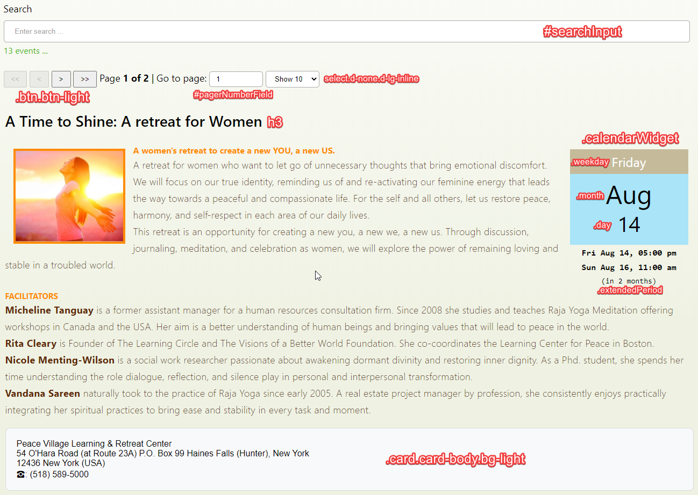

# BK Event Management Web Plugin

The Brahma Kumaris Event Management Web plugin allows you to retrieve event information for the centres of the
Brahma Kumaris and display these on a web page. It also capable of rendering and submitting registration forms associated
to these events so that end users can book specific events.

It can be used on any CMS's that support integration of HTML, CSS and Javascript and offers a fron-end based integration.
You will have to simply create a HTML page on the CMS you use and paste some HTML and CSS code
so that you can render an event list with this plugin.

## Pre-requisites

#### <a name="org_ids"></a>Organisation Id

In order to list events for a Brahma Kumaris organisation you will need to know its id. This information is available
here:

[Organisation Browser](https://events.brahmakumaris.org/bkregistration/templateChooser/eventBrowser.html)

or

[Organisation List](http://events.brahmakumaris.org/bkregistration_legacy/jsp/orgs.jsp)

Typically the number for an organisation is an integer like e.g:

    2 - London Willesden Green

#### <a name="event_types">Event Types

Then you must be also know which event types you want to display, like e.g: _course_, _lecture_, etc. The available
event types on the system are:

|  id |                 name | description                                                                     |
| --: | -------------------: | ------------------------------------------------------------------------------- |
|   4 |           conference | Conference with multiple participants                                           |
|   3 |               course | Course with more than one lesson                                                |
|  13 |        group session | Regular get together                                                            |
|  16 |       internal_event | Internal or BK Events                                                           |
|   1 |              lecture | Lecture with a lecturer.                                                        |
|   9 |           meditation | Meditation programmes                                                           |
|  10 |                 misc | miscellaneous events                                                            |
|  15 |      online activity | Online Activities                                                               |
|   7 |     panel discussion | Public discussion with a limited number of participants                         |
|  12 | power and protection | power and protection                                                            |
|  14 |              private | Private events not to be displayed on public websites                           |
|   5 |              retreat | Meeting of participants for an extended period of time with multiple activities |
|   2 |              seminar | Seminar witch interactive participation                                         |
|   8 |       special events | Special events                                                                  |
|  11 |             training | Training for BKs or other type of training                                      |
|   6 |             workshop | Programme with active member participation                                      |

Please note: that the event types _14_ and _16_ are typically not to be used by this plugin.

## Webpage Integration

Once you know your organisation id (it can also by multiple id's) and the event types you want to display
you have most of the needed information to start configuring your plugin.

### Example

Here is an example of the HTML that you need to create a page with a list of the combined events of multiple
centres of the Brahma Kumaris:

```html
<script>
  window.eventsConfig = {
    useBodyHiddenOverflow: true,
    useSimpleLayout: true,
    orgId: [2], // GCH only
    eventTypeIds: "1,2,3,4,5,6,7,8,9,10,11,12,13,15",
    language: "en-GB", // "es" for Spanish also supported now,
    onlyWebcast: true, // show only webcast events
    showLocalTime: true,
    displayWebcastButton: true, // displays the webcast button
    eventsLimit: 10, // show only one single event,
    singleEventUrlTemplate:
      "https://globalcooperationhouse.org/whatson-full/singleevent/@@eventDateId@@",
    suppressBookOnly: true, // Remove the book only button
    suppressVenue: true, // Hides the venue and add the buttons just right after the text. Works well in simple mode.
  };
</script>
<div id="root" class="container-fluid"></div>
<script src="https://eventswebclient-test-gil.bkwsu.eu/v0.18.0/starter.js"></script>
<script src="https://eventswebclient-test-gil.bkwsu.eu/v0.18.0/loader.js"></script>
```

### Configuration parameters and static parts

The above script has some parts that cannot be changed and some other parts where you can change the parameters.
Let us start with the **static parts**:

```html
<div id="root" class="container-fluid"></div>
<script src="https://eventswebclient-test-gil.bkwsu.eu/v0.21.0/starter.js"></script>
<script src="https://eventswebclient-test-gil.bkwsu.eu/v0.21.0/loader.js"></script>
```

Typically you will not need to configure the above HTML. The only thing that might change is the version of
the plugin which is embedded in the URL of the Javascript files, i.e. _v0.3.0_. If there is a plugin upgrade
the authors of the plugin might ask you to change this part of the URL.

The configuration parameters of this plugin are contained in the initial script of the HTML pasted above:

```html
<script>
  window.eventsConfig = {
    useBodyHiddenOverflow: true,
    useSimpleLayout: true,
    orgId: [2], // GCH only
    eventTypeIds: "1,2,3,4,5,6,7,8,9,10,11,12,13,15",
    language: "en-GB", // "es" for Spanish also supported now,
    onlyWebcast: true, // show only webcast events
    showLocalTime: true,
    displayWebcastButton: true, // displays the webcast button
    eventsLimit: 10, // show only 10 events,
    singleEventUrlTemplate:
      "https://globalcooperationhouse.org/whatson-full/singleevent/@@eventDateId@@",
    suppressBookOnly: true, // Remove the book only button
    suppressVenue: true, // Hides the venue and add the buttons just right after the text. Works well in simple mode.
    showCalendar: true, // If true displays the calendar view instead of the list view
  };
</script>
```

Please note that the code depicted above is Javascript and so must be syntactically correct.

|                   name | description                                                                                                                                            |
| ---------------------: | ------------------------------------------------------------------------------------------------------------------------------------------------------ |
|  useBodyHiddenOverflow | boolean value that switches off or on the vertical scrollbar when the event detail or registration form are displayed. Default is _false_              |
|        useSimpleLayout | boolean value which determines if the event description contains HTML or is simple text. _false_ means HTML is used                                    |
|                  orgId | The organisation ID as a Javascript array. You must have at least one. Please see the [Organisation Id](#org_ids) chapter on this page                 |
|           eventTypeIds | The id's of the event types you want to display. Please see the [Event Types](#event_types) chapter on this page                                       |
|               language | The language of the user interface. Currently only three codes are supported: _en-GB_ (British English), _en-US_ (American English) and _es_ (Spanish) |
|            onlyWebcast | boolean value that allows to display only webcast events in case it is _true_. Else it displays all events                                             |
|          showLocalTime | boolean value that controls whether the date is displayed in local time (_true_) or not (_false_)                                                      |
|   displayWebcastButton | boolean value that controls whether webcast button is displayed (_true_) or not (_false_)                                                              |
|            eventsLimit | integer value with the number of events which are to be displayed                                                                                      |
| singleEventUrlTemplate | URL with the link template of the external single event page. This is an optional parameter, but must include the _@@eventDateId@@_ token              |
|       suppressBookOnly | boolean value which determines, whether the booking only value is hidden or not                                                                        |
|          suppressVenue | boolean value which determines, whether the venue of the events is displayed or not                                                                    |
|           showCalendar | boolean value which determines, whether the calendar view (_true_) is displayed or not                                                                 |
|             eventsLang | Code used to filter events by language. Example _en_, _hi_, _es_. The codes follow the ISO 639-1 standard                                              |
|       displayOrgFilter | If _true_ then the organisation filter is visible otherwise not                                                                                        |

### CSS Styling

The most involved integration work will be definitely related to adapting the CSS styles to your page. The first
question that arises is where can you insert the modified styles? You have two options:

- Either you enter the CSS styles directly on the page using the `style` tag. See example below to get an idea on how this can be done.
- You create a separate CSS file and insert the CSS styles there using the CSS ``link tag`. This option is generally
  the preferred one, but it is up to you to decide.

We used [Bootstrap 4](https://getbootstrap.com/docs/4.5/getting-started/introduction/) in the plugin development
and therefore we follow the conventions of this framework.

#### Inline CSS Example

```html
<style type="text/css">
  #root {
    padding-left: 0;
    padding-right: 0;
  }

  #root h3 {
    font-size: 1.4em;
    font-family: "Lato", Helvetica, sans-serif !important;
  }

  #eventDisplayName {
    font-size: 1.4em !important;
    margin-left: 15px;
    font-family: "Lato", Helvetica, sans-serif !important;
  }

  .col-4.text-success {
    font-size: 0.8em;
    color: #999999 !important;
  }

  .btn.btn-light {
    background-color: #999;
    padding: 0 10px;
    height: 30px;
    margin: -2px 0;
  }

  .table .btn.btn-info,
  .simple-overlay .btn.btn-info {
    margin: 0 0 0px 0px;
    line-height: 7px;
  }

  .simple-overlay .btn.btn-info {
    margin: -25px 0 0px 15px;
  }

  .table .col-md-6.mt-3.mb-1 {
    padding-left: 0px;
  }

  .table td {
    border: 0 !important;
  }

  #pagerNumberField {
    height: 27px;
    font-size: 1em;
    padding: 4px 10px;
  }

  .d-none.d-lg-inline {
    padding: 4px;
    font-size: 0.9em;
  }

  span.d-none.d-lg-inline {
    padding: 4px 0 4px 4px;
  }

  .col-md-6.col-sm-12.text-right {
    font-size: 1em;
  }

  .weekday {
    font-size: 1.5em !important;
  }

  .simpleTimePeriod {
    font-size: 1em !important;
  }

  .fromNow {
    margin-top: -2px !important;
    font-size: 0.9em !important;
  }

  .table.table-hover,
  .row.mt-1.mb-1.ml-1,
  .simple-overlay {
    margin-left: -5px;
  }

  .simple-overlay {
    margin-right: -17px;
  }

  /* Calendar */

  .calendarWidget {
    width: 220px;
    margin: 0 0 0 auto;
    margin: 10px 0 0 20px;
  }

  @media only screen and (max-width: 768px) {
    /* For mobile phones: */
    .calendarWidget {
      width: 150px;
    }
  }

  .calendarWidget > .weekday {
    background: #c5bb9b;
    color: white;
    font-size: 1.5rem;
    padding: 5px 10px;
    text-align: center;
  }

  .calendarWidget > .month,
  .calendarWidget > .day {
    background: #a9e4f8;
    color: black;
    font-size: 3rem;
    padding: 0 10px;
    margin: 0 0 0 0;
    text-align: center;
  }

  .calendarWidget > .day {
    margin: -10px 0 0 0;
    padding-bottom: 10px;
    text-align: center;
    font-size: 2.5rem;
  }

  .calendarWidget > .simpleTimePeriod,
  .calendarWidget .extendedTimePeriod,
  .calendarWidget .fromNow {
    margin-top: 3px;
  }

  .calendarWidget > .simpleTimePeriod,
  .calendarWidget .extendedTimePeriod {
    font-weight: bold;
    font-family: monospace;
    font-size: 1rem;
  }

  .calendarWidget > .simpleTimePeriod,
  .calendarWidget > .fromNow {
    text-align: center;
  }

  .calendarWidget .extendedTimePeriod {
    text-align: center;
  }

  .calendarWidget .fromNow {
    font-size: 0.9rem;
    text-align: center;
    font-family: monospace;
  }
</style>
```

### Main CSS selectors

Here are the main CSS selectors highlighted on one of the current implementations. For more and extensive information
about the selectors please use the developers tools provided by Chrome.



### Available implementations of the plugin

Here are the available implementations of the EMS as of 2020 June 06th:

https://globalcooperationhouse.org/

https://www.agendas.lam.brahmakumaris.org/agenda-regional-latina/

### Live demos

Here are some links which allow to display events using different filters:

- All events in Global Co-operation House:

https://eventswebclient-test-gil.bkwsu.eu/v0.19.0/?orgId=2

- All events in Global Co-operation House in English:

https://eventswebclient-test-gil.bkwsu.eu/v0.19.0/?orgId=2&eventsLang=en

- All events in Global Co-operation House in Portuguese:

https://eventswebclient-test-gil.bkwsu.eu/v0.19.0/?orgId=2&eventsLang=pt

- All events in Global Co-operation House in Hindi:

https://eventswebclient-test-gil.bkwsu.eu/v0.19.0/?orgId=2&eventsLang=hi

- All events in Global Co-operation House in Spanish:

https://eventswebclient-test-gil.bkwsu.eu/v0.19.0/?orgId=2&eventsLang=es

- Organisation Filter for multiple example (English)

https://eventswebclient-test-gil.bkwsu.eu/v0.21.0/examples/event_list_uk_filter.html

- Organisation Filter for multiple example (Portuguese)

https://eventswebclient-test-gil.bkwsu.eu/v0.21.0/examples/event_list_brasil_filter.html

### Contacting for support

Please feel free to contact us in case you find bugs or need help integrating this plugin.

This is the contact of the main developer:

<a href="mailto:gil.fernandes@bkconnect.net">gil.fernandes@bkconnect.net</a>

### Compiling the bundle

To compile the bundle, please run the following command:

```
compile.bat
```

This will produce the bundle in the `dist` folder and the examples in the `examples` folder.

